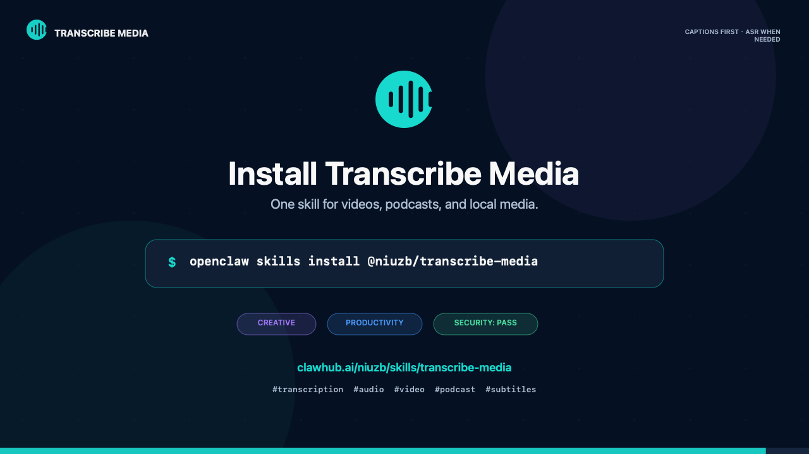

# transcribe-media

English | [简体中文](README.zh-CN.md)

**Turn the public videos and podcasts you already watch—as well as local media files—into text.**

`transcribe-media` is an Agent Skill for media transcription. Give it a public media URL or a local file: it first looks for captions already provided by the page, and only retrieves audio and calls VoiceFlow ASR when usable text is unavailable.

## 30-second demo

[](demo/transcribe-media-demo.mp4)

[Watch or download the captioned MP4 demo](demo/transcribe-media-demo.mp4). It works without audio and shows the caption-first, consent-gated transcription flow.

## Which sites are supported?

Provide a **public, directly accessible URL for one video or podcast episode**.

| Category | Popular sites |
| --- | --- |
| Video | **YouTube, Bilibili, Youku, iQIYI, Xigua Video, Vimeo, Dailymotion** |
| Short video and social media | **Douyin, TikTok, Xiaohongshu, Instagram, Facebook, X / Twitter** |
| Podcasts | **Xiaoyuzhou** |
| More public media pages | News, course, and other public single-item media sites |

Official share links such as `b23.tv` and `youtu.be` are also accepted. Website behavior changes over time, so actual availability depends on whether the specific URL is publicly accessible and can be resolved as one media item at the time of the request.

## Why is it fast and efficient?

### Captions first—no unnecessary transcription

For a public video, the Skill checks for manual or automatically generated captions first. When usable text is available, it cleans and returns that text without downloading the media or calling ASR.

### No captions? Keep going

When a page has no reliable captions, the Skill explains the external processing path and asks for approval. Only after approval does it retrieve a compatible public audio track and send it to VoiceFlow ASR. Public Xiaoyuzhou episodes can also be transcribed from their public audio with the same consent gate.

### Local files work too

The following formats are supported, up to 512 MiB per file:

`FLAC` · `M4A` · `MP3` · `MP4` · `MPEG` · `OGG` · `WAV` · `WebM`

For local video, FFmpeg extracts the audio on your machine before transcription.

## Security and privacy

Security is the default behavior, not an add-on:

- **Public content only:** private, paid, DRM-protected, login-required, and private-network media are rejected.
- **No website credentials:** the Skill does not request media-site usernames, passwords, phone numbers, SMS codes, or CAPTCHA results. It does not call Xiaoyuzhou login or SMS verification interfaces.
- **No media upload when captions are enough:** if usable page captions exist, the text is returned without sending audio or video to ASR.
- **Explicit upload consent:** media can leave the device only when `--allow-remote-asr` is provided for that run after the user approves sending it to the VoiceFlow API and a provider-issued signed HTTPS storage URL.
- **Deleted after transcription:** VoiceFlow deletes the uploaded media as soon as transcription reaches a terminal state, before returning that result. A mandatory private-storage lifecycle removes the object within 2–3 days if immediate best-effort deletion is interrupted.
- **Explicit tool consent:** if a compatible `yt-dlp` is unavailable, the pinned release is cached only when `--allow-tool-download` is provided after approval.
- **No silent dependency installation:** the Skill reports a missing FFmpeg dependency and does not authorize installation without explicit user approval.
- **Locally generated token:** browser authorization submits only a token digest; the complete token is not included in the approval request.
- **Private credential storage:** on Unix systems, credential directories and files use `0700` and `0600` permissions, with file type, ownership, and permissions checked before use.
- **Controlled retrieval:** remote URLs are checked for HTTPS, DNS resolution, and public network addresses. Redirects, file types, response sizes, and media sizes are bounded.
- **Verified tooling:** when a media resolver must be downloaded, only a pinned official release is accepted and its SHA-256 digest is verified before execution.
- **Secrets stay out of child processes:** `VOICEFLOW_TOKEN` is removed from the environment used by the media resolver.

> Review your privacy and compliance requirements before submitting sensitive audio or video to a remote ASR service.

## Quick start

### Install as a Codex Skill

```bash
git clone https://github.com/niuzb/transcribe-media.git \
  "${CODEX_HOME:-$HOME/.codex}/skills/transcribe-media"
```

Restart Codex if the Skill is not discovered immediately. Other Agent Skills-compatible runners can install the complete repository in their configured Skills directory.

### Ask an agent to transcribe

Transcribe a local file:

```text
Use $transcribe-media to transcribe /absolute/path/to/interview.mp3.
```

Extract text from a public video:

```text
Use $transcribe-media to extract the transcript from this public video URL:
https://example.com/watch/id
```

The Skill returns a source-faithful raw transcript. It does not automatically proofread, rewrite, summarize, or translate the result.

## Use the CLI directly

Local file:

```bash
node scripts/transcribe.mjs \
  --file "/absolute/path/to/audio.wav" \
  --allow-remote-asr
```

Public video or podcast episode:

```bash
node scripts/transcribe.mjs --url "https://example.com/watch/id"
```

The first URL run can return existing captions without uploading media. If it reports that remote ASR is required, review the disclosure and rerun with `--allow-remote-asr` only after approval. If it reports that managed `yt-dlp` is unavailable, rerun with `--allow-tool-download` only after separately approving the pinned download and cache location.

Specify a language only when the source language is known:

```bash
node scripts/transcribe.mjs \
  --file "/absolute/path/to/audio.wav" \
  --language en \
  --allow-remote-asr
```

Run `node scripts/transcribe.mjs --help` for model, provider, polling, and timeout options.

## VoiceFlow authorization

Extracting captions already exposed by a page does not require a VoiceFlow token. A token is needed only for local media or a public URL that requires ASR. Before `--allow-remote-asr` is used, the user must approve sending the media and basic file metadata over HTTPS to `asr.audioflow123.com` and a provider-issued signed storage URL. VoiceFlow deletes the uploaded media as soon as transcription reaches a terminal state and before returning that result. The deletion is idempotent and best-effort; a mandatory lifecycle on the private storage bucket removes any object left by an interrupted deletion within 2–3 days.

Check the current status:

```bash
node scripts/auth.mjs status
```

If the status is `not_connected`, start browser authorization:

```bash
node scripts/auth.mjs begin
```

Open the returned verification URL, approve the request, and finish the flow:

```bash
node scripts/auth.mjs wait
```

You can alternatively provide `VOICEFLOW_TOKEN` in the environment. Environment tokens take precedence and are not persisted by the Skill. Never place a token in command arguments, logs, source files, or Git.

## How it works

```text
Public media URL
    ↓
Validate HTTPS and public routing; confirm a single public media item
    ↓
Usable captions? ── yes → extract and clean captions → return text
    │
    no
    ↓
Obtain explicit upload approval → retrieve audio → VoiceFlow ASR → return text
```

A controlled media-resolution layer handles public pages. Under the hood, it uses `yt-dlp` to inspect metadata and retrieve captions or a public audio track. The Skill reuses a compatible system installation or previously verified managed copy when available. Otherwise, it asks for approval before downloading and caching a pinned official release whose SHA-256 digest is verified before execution.

## Usage boundaries

- Remote input must be a public HTTPS page for **one** video or podcast episode.
- Playlists, channels, profiles, search pages, and multi-item collections are not supported.
- Live streams, private or paid content, login-required media, DRM media, and private-network URLs are rejected.
- Website behavior can change, so an individual platform may occasionally require an upstream media-resolver update.
- Make sure you have the right to access and process the input, and follow the source site's terms and applicable laws.

## Requirements

- Node.js 24 or later.
- FFmpeg for local video audio extraction and remote formats that require conversion. The Skill does not install it without explicit approval.
- A VoiceFlow token only when ASR is required; extracting public captions does not require one.

The runtime uses Node.js built-ins and does not require `npm install`.

## Development

Run the complete test suite:

```bash
node --test scripts/*.test.mjs
```

Repository layout:

```text
.
├── SKILL.md                 Agent workflow and safety rules
├── agents/openai.yaml       Skill display metadata
├── references/              Platform-specific instructions
└── scripts/                 Runtime modules and Node.js tests
```

## License

The GitHub source repository is licensed under the
[Apache License 2.0](LICENSE). Releases distributed through ClawHub are also
available under MIT-0, as required by the ClawHub registry terms.
